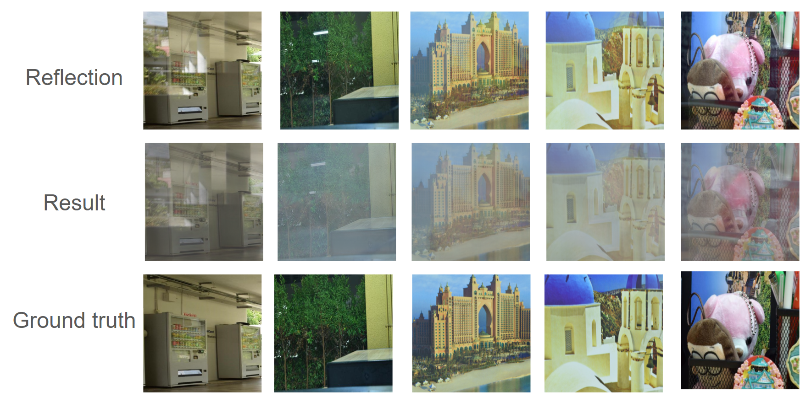

# DIP_FinalProject

## Overview

### Motivation
When photographing objects behind glass, ambient light or other interference often reflects on the glass surface, which negatively affects image quality and visibility. Removing these reflections, or dereflection, enhances image clarity, enabling more accurate object recognition and improved background segmentation for various applications.

Reflection removal is a crucial task in various computer vision and image processing applications. 
Some common applications of reflection removal include:

* **Autonomous driving** : Removing reflections from windshield or window images enhances the clarity and accuracy of scene understanding, ensuring safer navigation.
* **Medical image analysis** : Eliminating reflections from imaging devices or glass barriers improves the visibility of critical details, facilitating more accurate diagnoses and evaluations.

### Method
Inspired by the [Cold-Diffusion](https://github.com/arpitbansal297/Cold-Diffusion-Models) framework, which replaces noise-based destruction in diffusion models with deterministic transformations, we adapt this approach to better suit the requirements of dereflection.

### Project Directory 

- **`reflection-diffusion-pytorch/`**: Our custom implementation for reflection removal.
- **`Cold-Diffusion-Models-main/`**: Original Cold-Diffusion code.
- **`ReflectionSeparation-master/`**: Baseline code for reflection separation.

## Setup and Preparation Process
### Step 1 : Environment Setup

#### 1. Use conda (Optimal)
```
conda env create -f requirements.yml 
```

#### 2. Use pip
```
pip install -r environment.txt
```

### Step 2 : Dataset Preparation

Download the [SIR2](https://sir2data.github.io/) dataset and place it in the `data/SIR2` folder.

Then, run the command `python create_data.py`.

## Usage
### Hyperparameters

* β : 0.3
* loss_type : l2
* time_steps : 100
* train_steps : 45000

First, you need to navigate to the folder where our code is located in order to execute the train and test commands.

```
cd reflection-diffusion-pytorch                        
```

### Train

```
python reflection_removal.py --save_folder <Path to save images>                    
```

### Test

You can download our model weights [here](https://drive.google.com/file/d/1h5xB0APiZVwZLunLkDf2uFQNn3l6olDh/view?usp=sharing).

```
python reflection_removal_test.py --save_folder <Path to save images> --load_path <Path to load model>                
```


## Experiment results


